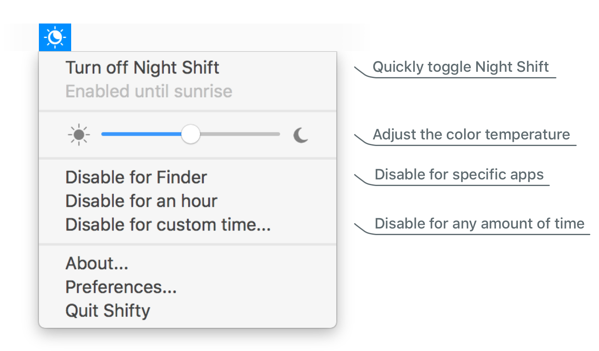
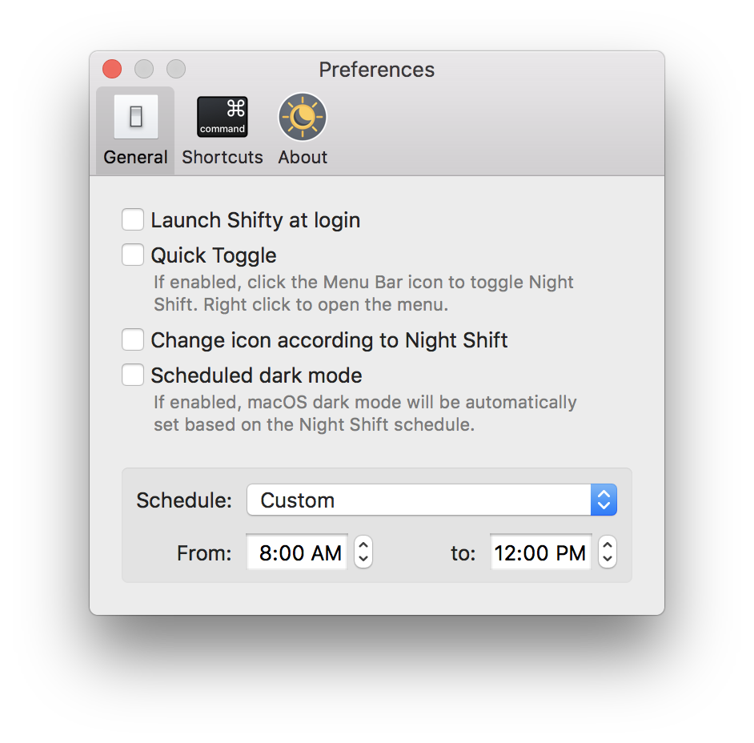

Shifty was made to expand the capabilities of the built in Night Shift feature in macOS. You can disable Night Shift for specific apps and custom time periods. It also provides easy access to a slider to fine tune your color temperature. With Shifty, Night Shift becomes a power user feature!

Shifty is customizable! Make it easier to toggle Night Shift with Quick Toggle or set dark mode based on the schedule. For common Shifty actions, you can set global keyboard shortcuts.

### System requirements:
* macOS 10.12.4 or later
* System meets the [requirements for Night Shift](https://support.apple.com/en-us/HT207513#requirements)

 
Shifty is free and open source, licensed under AGPL-3.0. Feel free to make a pull request!
