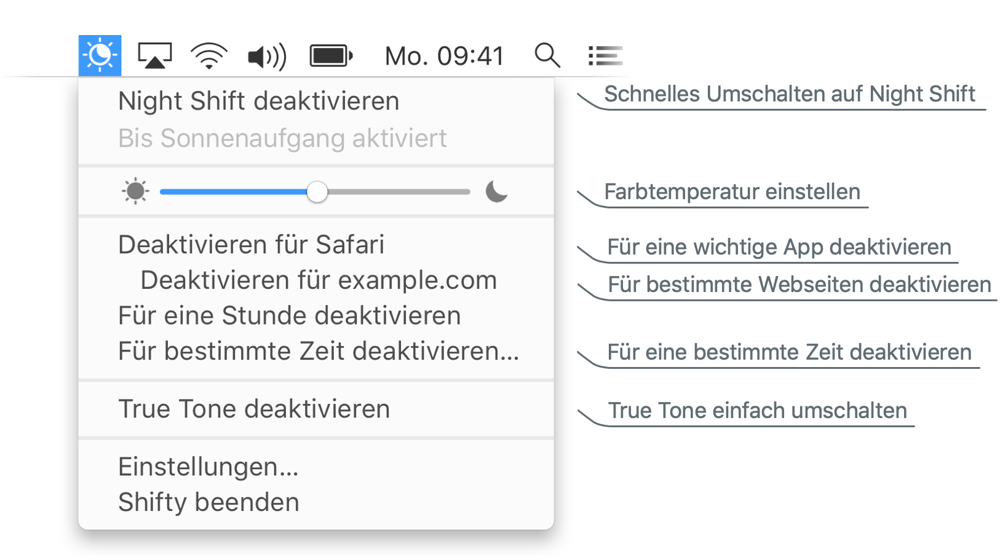
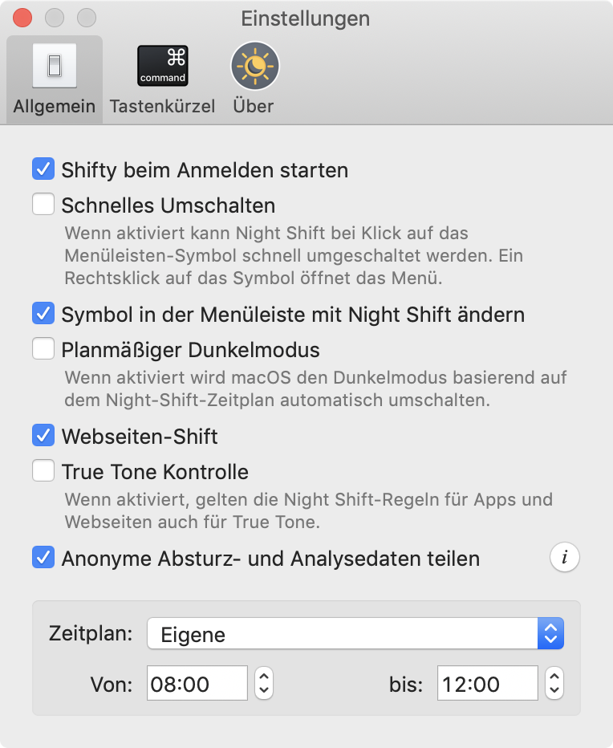

Shifty erweitert die Möglichkeiten der Night-Shift-Funktion in macOS. Night Shift kann für bestimmte Apps, Webseiten und einstellbare Zeiten deaktiviert werden. Der Zugriff auf einen Schieberegler zum genauen Einstellen der Farbtemperatur ist auch verfügbar. Mit Shifty wird Night Shift zur Power-Funktion!

  

  

    Shifty ist anpassbar!
    <ul>
      <li>Vereinfachen Sie das Umschalten von Night Shift mit Schnelles Umschalten</li>
      <li>Dunkelmodus mit Shiftys Zeitplan setzen</li>
      <li>Night Shift Regeln beeinflussen auch True Tone</li>
      <li>Für häufige Shifty-Aktionen globale Tastenkombinationen setzen</li>
    </ul>
  

  

    
  

##### Systemanforderungen:

* macOS 10.12.4 oder höher
* Das System erfüllt die [Night-Shift-Arforderungen](https://support.apple.com/HT207513#requirements)
* Webseiten-Shift unterstützt Safari, Chrome und Vivaldi
* True Tone Funktionen benötigt einen [unterstützten Mac](https://support.apple.com/HT208909) und macOS 10.14 oder höher

  Shifty unterstützen und [spenden]({{ site.donate_link_usd }}), um es noch besser zu machen.

Shifty ist gratis und als Open-Source unter der [GPLv3]({{ site.license_link }}) lizenziert. [Bei GitHub mitwirken]({{ site.repository_link }})

Bei Verbesserungsvorschlägen zu Übersetzungen auf der Webseite oder in der App <a href="/translate">bitte hier mithelfen</a>.
