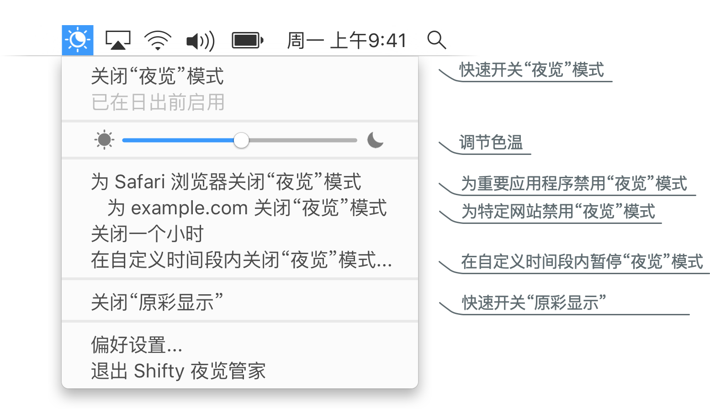
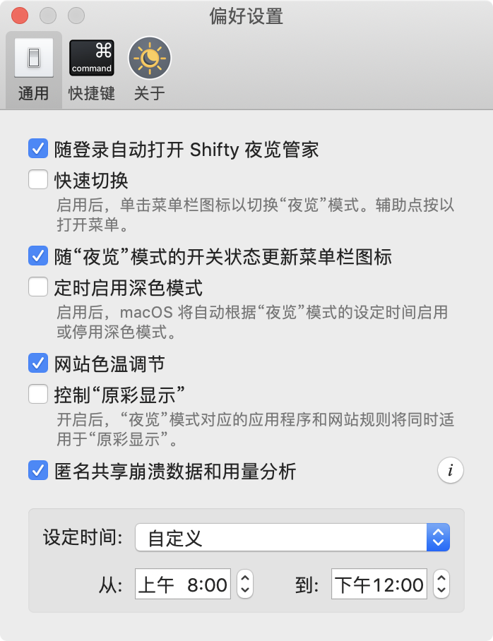

Shifty 夜览管家为 macOS 内置的夜览模式赋予更多便捷与自定义控制选项。 你可为特定应用程序、网站和在自定义时间段暂时关闭“夜览”模式。 此外，易于访问的滑块使完善色温变得轻而易举。 有了 Shifty 夜览管家，“夜览”模式得以成为专业用户的天作之合。

  

  

    你也可以自定义 Shifty 夜览管家！
    <ul>
      <li>通过快速开关轻松控制“夜览”模式</li>
      <li>随“夜览”的设定时间开关深色模式</li>
      <li>“夜览”模式对应的规则同时适用于“原彩显示”</li>
      <li>为常用的 Shifty 夜览管家功能设置全局键盘快捷方式</li>
    </ul>
  

  

    
  

##### 系统要求:

* macOS 10.12.4 或更高版本
* Mac 电脑机型符合[夜览模式的系统需求](https://support.apple.com/HT207513#requirements)
* 网站色温调节支持 Safari 浏览器、Chrome 和 Vivaldi
* 需要[兼容“原彩显示”的 Mac](https://support.apple.com/HT208909) 才能使用相关功能

  如果你钟爱并乐于改善 Shifty 夜览管家，[向开发者贡献自己的一份捐助]({{ site.donate_link_usd }})。

Shifty 夜览管家免费且开源，许可证为 [GPLv3]({{ site.license_link }})。 [通过 GitHub 参与开发]({{ site.repository_link }})

如果网站或应用程序中的翻译存在不妥，请考虑通过[这里](http://translate.shifty.natethompson.io)贡献您的翻译。